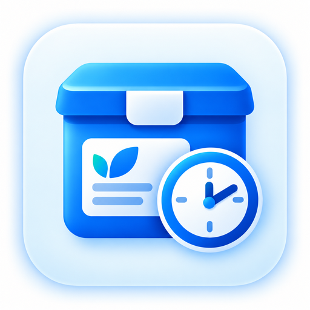
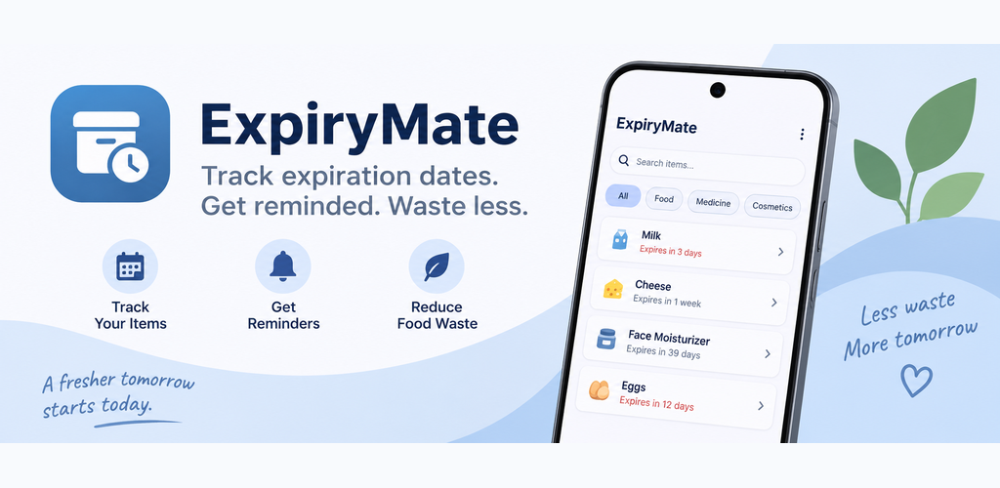
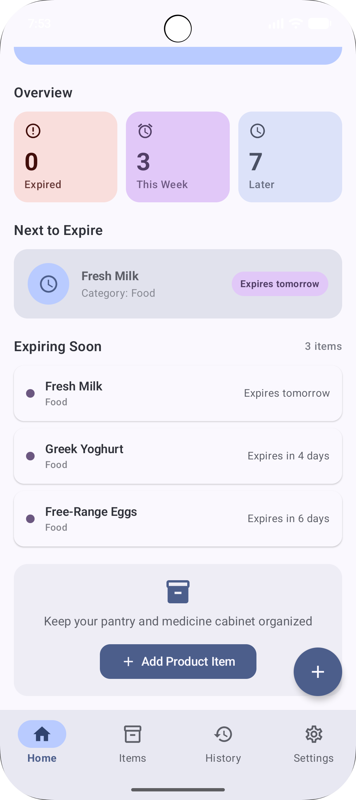
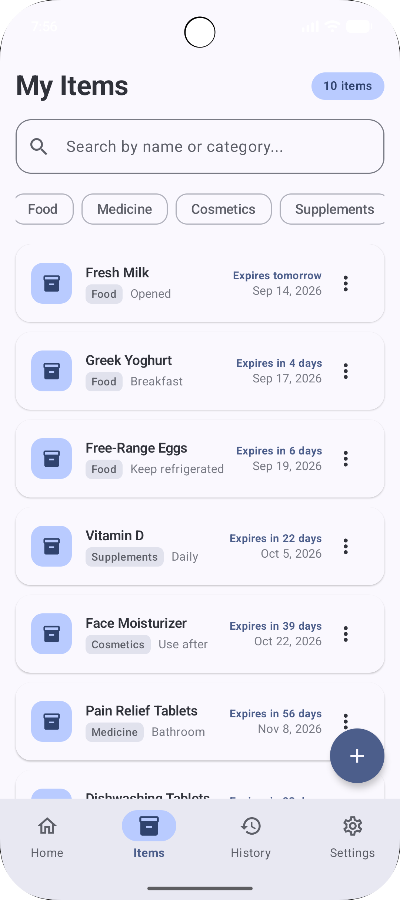
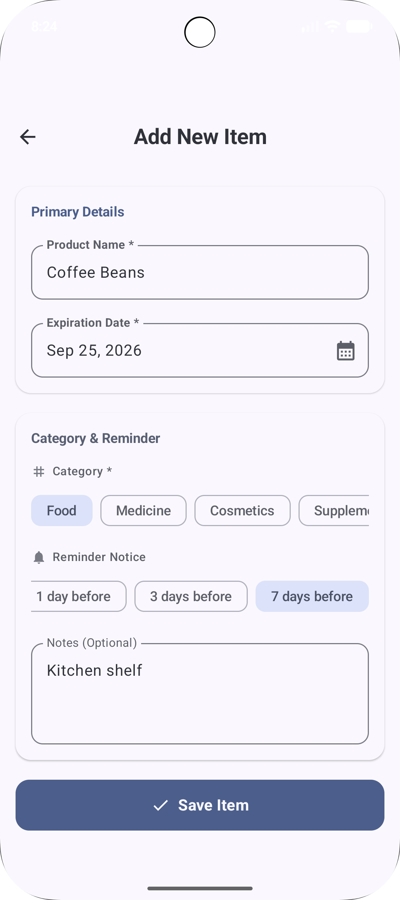
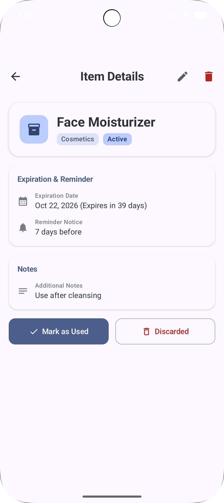
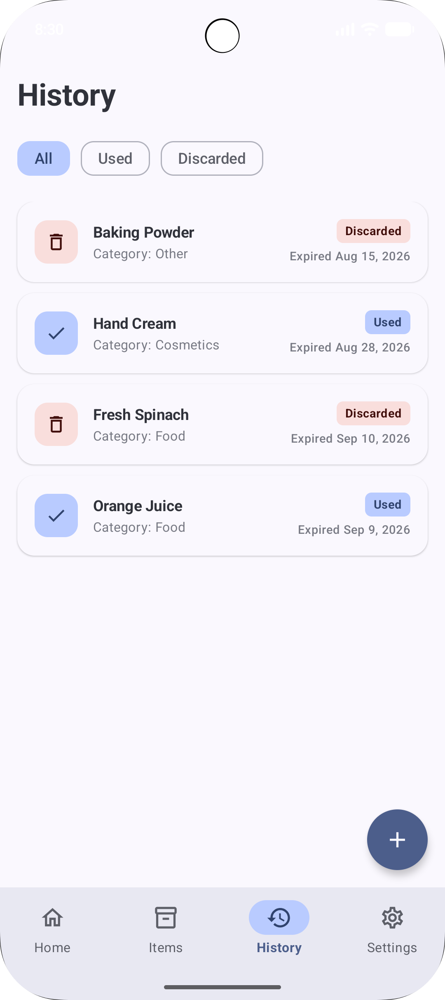
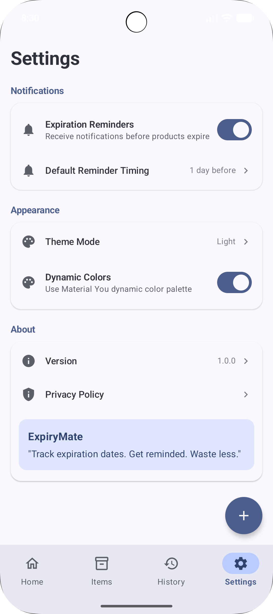

<div align="center">



# ExpiryMate

### Track expiration dates. Get reminded. Waste less.

A local-first Android app for keeping track of expiration dates across food, medicine, cosmetics, supplements, household products, and more.

<br>


<br>



</div>

---

## About ExpiryMate

**ExpiryMate** helps you keep track of products before they expire.

Add an item, choose its expiration date and reminder timing, and let ExpiryMate keep the important dates organized for you.

No account. No cloud dependency. No ads. Your item data stays local to your device.

### Highlights

- 📅 Track expiration dates
- 🔔 Receive local reminders before items expire
- ⏳ Quickly see what is expiring soon
- 🗂️ Organize items by category
- ✅ Mark items as Used or Discarded
- 🕘 Review item history
- 🔎 Search and filter your active items
- 🌗 Light, Dark, and System themes
- 🎨 Material You dynamic colors on supported devices
- 🇬🇧 English and 🇹🇷 Turkish localization

---

## Screenshots

<div align="center">

| Home | Items | Add Item |
|:---:|:---:|:---:|
|  |  |  |

| Item Details | History | Settings |
|:---:|:---:|:---:|
|  |  |  |

</div>

---

## How It Works

1. **Add an item** with its expiration date.
2. **Choose a category** and reminder timing.
3. ExpiryMate schedules a **local notification**.
4. Check the Home screen to see what's expiring next.
5. Mark the item as **Used** or **Discarded** when you're done.

---

## Built With

| Area | Technology |
|---|---|
| Language | Kotlin |
| UI | Jetpack Compose + Material 3 |
| Navigation | Navigation Compose |
| Local Database | Room |
| Preferences | DataStore |
| Background Work | WorkManager |
| Reactive State | Flow / StateFlow |
| Dependency Injection | Manual `AppContainer` |
| Notifications | Android Notifications |
| Code Generation | KSP |

### Android

```text
minSdk     26
targetSdk  37
compileSdk 37
```

---

## Architecture

ExpiryMate keeps its architecture intentionally straightforward:

```text
┌──────────────────────┐
│   Jetpack Compose    │
│         UI           │
└──────────┬───────────┘
           │
           ▼
┌──────────────────────┐
│      ViewModels      │
│   Flow / StateFlow   │
└──────────┬───────────┘
           │
           ▼
┌──────────────────────┐
│   Repository Layer   │
└──────┬────────┬──────┘
       │        │
       ▼        ▼
    Room     DataStore
       │
       └──────────────► WorkManager / Notifications
```

The current V1 intentionally does **not** use:

- Hilt
- Firebase
- Backend APIs
- Authentication
- Analytics
- Advertising SDKs
- Cloud databases

---

## Privacy

ExpiryMate is designed as a **local-first** application.

Current V1 behavior:

- No account required
- No backend
- No cloud sync
- No analytics
- No ads
- No tracking
- No Firebase
- No developer-controlled data transmission

Item data and app preferences are stored locally on the device.

Android system backup may back up application data depending on device and Google backup settings.

### Privacy Policy

[Read the ExpiryMate Privacy Policy](https://bygones34.github.io/ExpiryMate/privacy-policy.html)

---

## Localization

ExpiryMate currently supports:

- 🇬🇧 English
- 🇹🇷 Turkish

The app automatically follows the Android system language.

Unsupported locales fall back to English.

---

## Build Locally

Clone the repository:

```bash
git clone <repository-url>
cd ExpiryMate
```

### Windows / PowerShell

```powershell
.\gradlew :app:assembleDebug
```

### macOS / Linux

```bash
./gradlew :app:assembleDebug
```

The generated debug APK can be found at:

```text
app/build/outputs/apk/debug/app-debug.apk
```

Run the unit tests:

```powershell
.\gradlew :app:testDebugUnitTest
```

---

## Project Status

ExpiryMate is currently being prepared for its **first Google Play release**.

### Completed

- ✅ Core expiration tracking flow
- ✅ Room persistence
- ✅ Local reminder notifications
- ✅ Item Detail / Edit / Delete
- ✅ Used / Discarded history
- ✅ Light / Dark / System themes
- ✅ Dynamic Colors
- ✅ Dedicated notification small icon
- ✅ Light / dark splash treatment
- ✅ Category-specific icons
- ✅ First-launch welcome experience
- ✅ English / Turkish localization
- ✅ Privacy Policy
- ✅ Play Store screenshots
- ✅ Feature graphic
- ✅ Real-device notification verification

### Release Work Remaining

- ⏳ Google Play Console setup
- ⏳ Data Safety declaration
- ⏳ Play App Signing
- ⏳ Signed Android App Bundle
- ⏳ Internal Testing
- ⏳ Pre-launch report
- ⏳ Production release

---

## Future Ideas

Features intentionally outside the first-release scope include:

- Barcode scanning
- OCR / camera support
- Export / import
- Cloud sync
- Accounts / family sharing
- Additional languages

---

## Contributing

ExpiryMate is currently under active development.

Bug reports and feature suggestions are welcome through GitHub Issues.

---

## License

A license has not yet been specified.